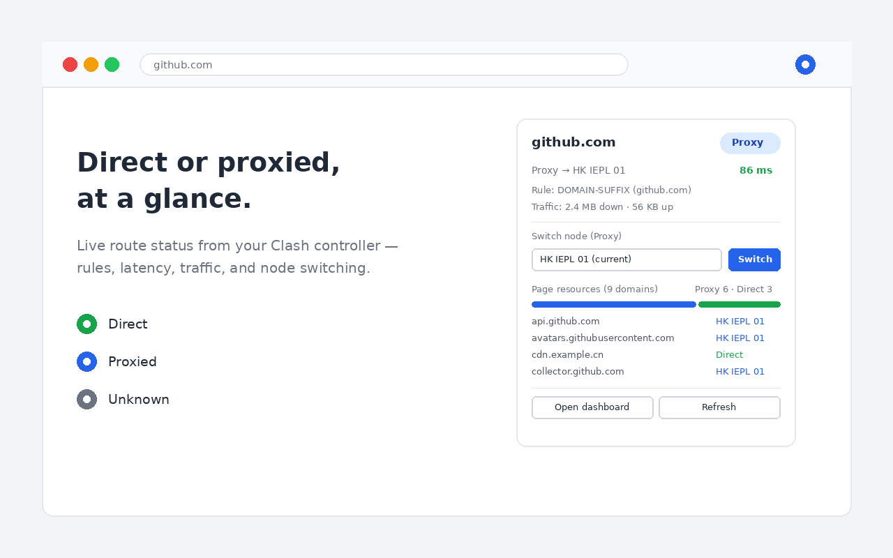

# Clash 指示器 / Clash Indicator

一个轻量 Chrome 扩展：实时显示当前页面走**直连**还是**代理**，基于 Clash external controller API，纯只读、零数据收集。

A lightweight Chrome extension that shows whether the current page goes **direct** or through a **proxy**, powered by the Clash external controller API. Read-only, zero data collection.



## 功能 / Features

- 工具栏图标实时变色：绿 = 直连，蓝 = 代理，灰 = 未知，红 = 无法连接 Clash
- 弹窗显示命中规则、节点链和节点延迟
- 页面资源去向汇总：当前页所有域名各走哪条路线，比例条一目了然
- 一键打开 Clash 面板
- 新装引导页，两步完成配置
- 中英双语（跟随浏览器语言或手动切换）

Toolbar icon changes color in real time (green = direct, blue = proxy). The popup shows the matched rule, proxy chain, node latency, and a per-domain route breakdown. Read-only by design — it never changes your Clash state.

## 安装 / Install

**商店安装**：Chrome Web Store 上架后在此更新链接。

**手动安装 / Manual:**

1. 下载本仓库（Code → Download ZIP）并解压 / Download and unzip this repo
2. 打开 `chrome://extensions`，开启右上角「开发者模式」/ Enable Developer mode
3. 点「加载已解压的扩展程序」，选择本项目目录 / Click "Load unpacked" and select the project folder

## 配置 / Setup

扩展通过 Clash 的 external controller API 工作，需要两步：

1. Clash 配置文件（config.yaml）中确认：

```yaml
external-controller: 0.0.0.0:9090   # 或 127.0.0.1:9090
secret: "你的密码"                    # 可选但建议设置
```

2. 点扩展图标 → 设置 → 填入 controller 地址（默认 `http://192.168.10.1:9090`，支持 https）和 secret → 测试连接 → 保存。

Clash Verge / Clash for Windows 用户可在客户端设置界面直接查看 controller 地址和 secret。

## 工作原理 / How it works

Chrome 扩展 API 无法获知单个请求实际使用的代理，本扩展改为查询 Clash 自身：通过 `/connections` 接口匹配当前页面的域名，读取命中的规则和出口链；通过 `/proxies` 获取延迟和节点组。所有请求仅发往你配置的本地 controller 地址，不与任何外部服务器通信。

Chrome's extension API does not expose which proxy a request actually used, so this extension asks Clash itself via its local REST API (`/connections`, `/proxies`). All requests go only to your configured local controller. Nothing is collected or transmitted elsewhere — see [PRIVACY.md](PRIVACY.md).

## 常见问题 / FAQ

**显示"未知"？** 连接已关闭且缓存过期，刷新页面后重新打开弹窗即可。

**显示红色感叹号？** 无法连接 controller：检查地址、secret，以及 Clash 是否在运行、external-controller 是否监听了对应地址。

**HTTPS controller 报错？** 自签名证书需先在浏览器中手动访问一次 controller 地址并信任证书。

## 开发 / Development

无构建步骤，原生 MV3。打包上架用 `./pack.sh`，产物为 `dist/clash-indicator.zip`。

No build step, plain Manifest V3. Run `./pack.sh` to produce the store-ready zip.

## License

[MIT](LICENSE)
